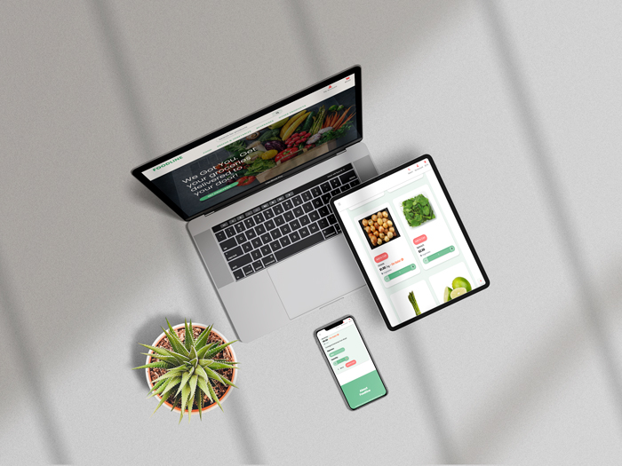
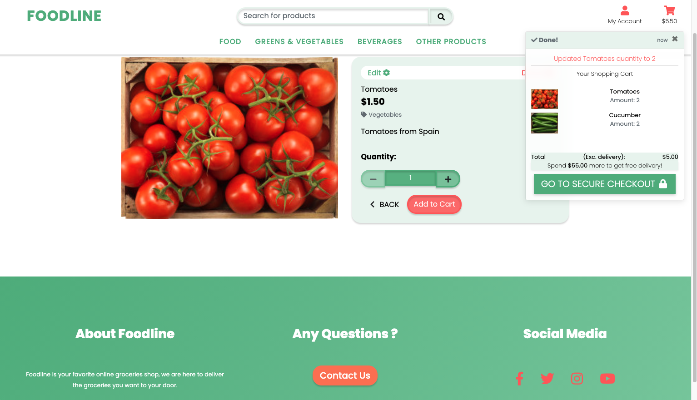
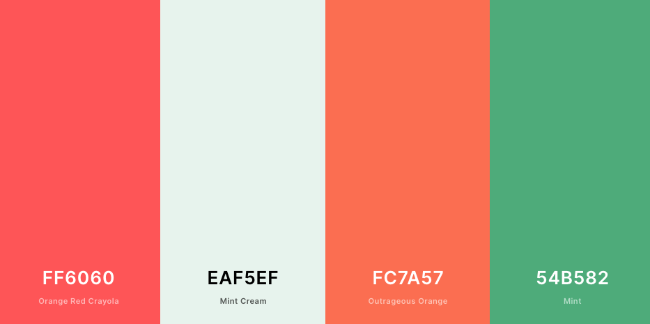

<h1>FOODLINE</h1>
<h1 align="center"></h1>

 <a href="https://foodline-1.herokuapp.com">Live website</a>

  <a href="https://github.com/DADEVFA/foodline">GitHub Repository</a>

## About

Foodline, an everyday online groceries shop. 

## Table of contents: 
* [General](#general)
* [App Objectives](#objectives)
* [Technologies](#technologies)
* [Database](#database)
* [UX](#ux)
* [Design](#design)
* [Testing](#testing)
* [Deployment](#deployment)
* [Credits](#credits)

# General
Webshop that sells everything you would find in your daily groceries shop. A simple yet advanced feeling and look.  

# Technologies

## Languages: 

* HTML5
* CSS3
* Javascript
* Python 3

## Programs, Frameworks, APIs & Libraries:

* Adobe Xd - Create Wireframe & design the website.
* Adobe Photoshop - Crop images & logo. 
* Django - Application Framework.
* Bootstrap - For layout, minor functions and base structure. 
* Git - Version Control & track changes in code.
* GitHub - Host all code files. 
* Gitpod - Code enviroment, allows code to pe pushed to Github.
* Google Fonts - Fonts.
* Font Awesome - Complements the design.
* Heroku - Deploy the app.
* Amazon AWS S3 for static and media files.
* Stripe - For payment transactions


# Objectives 

```
Sell groceries that customers needs in an instant. 
The less time the user spends on the website the better.
Users can easily fill their carts and to checkout fast,
even faster if they are have saved their details. 
```

# User Types
* Admin (FOODLINE)
* Customers 
* Delivery Crew 


# UX - User Experience

## As a user of the app: 

1. I want to be able to understand everything without much effort.

2. I want to be able to add products I need quickly. 

3. I want to be able to see all my products before I pay.

## As the owner of the app:

1. I want to be able to see all my orders. 

2. I want to be able to stop selling a product if needed. 

3. I want to be able to add more products. 


# Design 

<h1 align="center"></h1>

### Fonts: 

For most text:
```
* Main font: Poppins

* Fallback font: Sans-Serif
```


### Colors: 
<h1 align="center"></h1>

# Database Schema
<h1 align="center"></h1>


## Future features: 
* User can save carts and name them.
* Multiple languages
* Diffrent currencies
* Progress bar until reached delivery is free

## Bugs (Known Issues): 
1. Ripeness doesn't work - Fixed
2. Filtered products goes to default when user adds to cart - 
3. All set ripeness of one product get deleted on delete in cart -  
4. Checking out with Ripe products issues atm - Fixed 


## Testing
[Click here for tests documents](testing.md)

# Deployment

### Local Deployment ###


1. Clone Repository. You can run this project locally on any IDE you prefer; by downloading the Github repository at https://github.com/dadevfa/foodline.git and by clicking the "Download Code" button. You can also run this command in command line: 

```

$ git clone https://github.com/dadevfa/foodline.git

```
2. Install Python required modules.
Run **pip3 install -r requirements.txt** in command to install all the module required to run the project:


3. Store the environment variables:

```

'SECRET_KEY', '<your_value>'
'STRIPE_PUBLIC_KEY', '<your_value>'
'STRIPE_SECRET_KEY', '<your_value>'
'STRIPE_WH_SECRET', '<your_value>'
```

4. Migrate your database models. Run following commands below to migrate the models and set up an SQLite database:

````
python3 manage.py makemigrations --dry-run
python3 manage.py makemigrations
python3 manage.py migrate --plan 
python3 manage.py migrate
````

5. Create SuperUser so you can access the admin panel in Django. Run the command:

````
python3 manage.py createsuperuser
````

7. Enter the command below to start running the project locally:

````
python3 manage.py runserver
````

# Heroku
These are the steps to deploy Foodline project to Heroku

1. Create New App
2. Connect to github and pick your github repository and connect
3. Resources tab and search for postgres, select 'Heroku Postgres'
4. On the settings tab go to 'Buildpacks' and click 'Add buildpack'
5. Enter https://github.com/heroku/heroku-geo-buildpack.git
6. Add the Python buildpack
7. The https://github.com/heroku/heroku-geo-buildpack.git needs to be above the heroku/Python buildpack
8. In the settings tab click 'reveal config vars' and add the following variables:

    - AWS_ACCESS_KEY_ID=YOUR_AWS_ACCESS_KEY_ID
    - AWS_SECRET_ACCESS_KEY=YOUR_AWS_SECRET_ACCESS_KEY
    - EMAIL_HOST_PASS=YOUR_EMAIL_HOST_PASS
    - EMAIL_HOST_USER=YOUR_EMAIL_HOST_USER
    - SECRET_KEY=YOUR_DJANGO_SECRET_KEY
    - STRIPE_PUBLIC_KEY=YOUR_STRIPE_PUBLIC_KEY
    - STRIPE_SECRET_KEY=YOUR_STRIPE_SECRET_KEY
    - STRIPE_WH_SECRET=YOUR_STRIPE_WH_SECRET
    - USE_AWS=True

9. Deploy Branch in deployment section (with 'main' selected)
10. Enable automatic deploys, which will redeploy automatically every time you push to your choosen branch.
11. In the top right click 'More' and select 'Run Console'
12. Enter 'python manage.py migrate' and click 'Run'
13. Enter 'python manage.py createsuperuser' and click 'Run'
14. Enter any required details to create a superuser for the django admin
15. Click 'Open App' in the top right!

# Credits
* This app was made following the Boutique Ado project by Chris Zielinski. 
* Code Institute Slack community
* Code Institute for the start template with presets and plugins in Gitpod.
* Code Institutes 
* Code Institute Student Support
* Stackoverflow community.
* My mentor